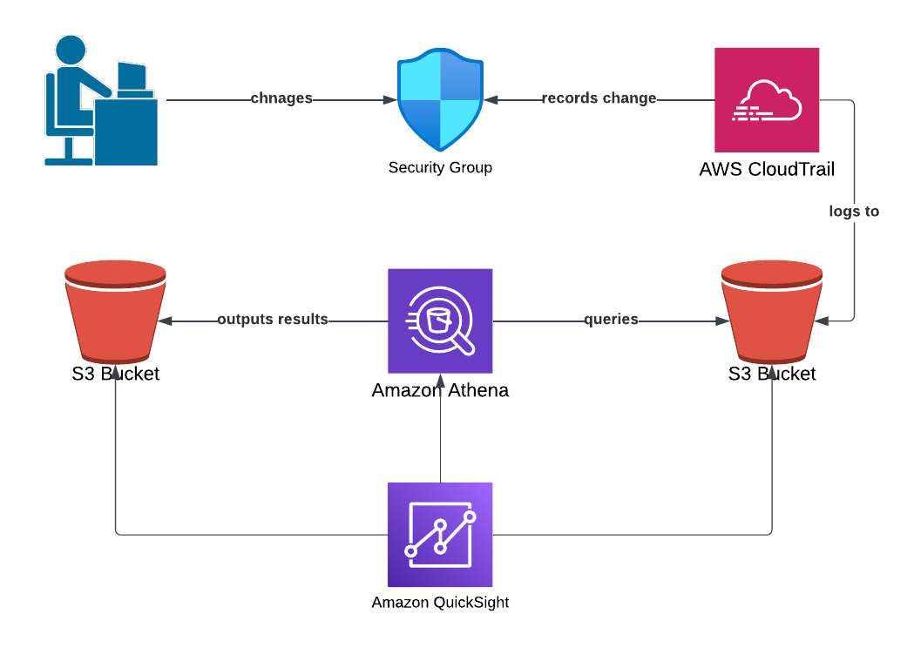

# cloudtrail-quicksight

This Terraform script sets up QuickSight to create a almost-near-real time (a few minutes lag) report of security group rule changes.  A custom CloudTrail trail delivers logs to S3.  When the QuickSight report is refreshed, Athena queries the logs.  QuickSight is connected to Athena as a datasource and filters for the correct event.  QuickSight produces a tabular report of the rule changes when made.

The bulk of the work is done in athena.tf and .quicksight.tf.  Notice in athena.tf that a Glue data catalog is used instead of Athena table resource.  Furthermore, the userIdentity attribute in CloudTrail logs is a STRUCT which QuickSight does not ingest.
Therefore, the STRUCT is converted into a JSON string as noted in the code.  The quicksight.tf sh0ws the hieracrhcy of QuickSight constructs and how they chain together (data source -> data set -> analysis -> template -> dashboard).  Also, the quicksight-manifest.json is imported.

To run successfully, you must have a QuickSight account.  This will cost some money after the first month (~$22/month).  So cancel your subscritption before the first month expires.  You need to give QuickSight the permissions to read the S3 buckets and use Athena.  This can be done top tight.... Manage QuickSight -> Security & Permissions.  Grant access to the bucket storing the CloudTrail logs and the bucket storing the Athena results.  Also, grant access to Athena.  Finally, make sure your Quicksight user is an Admin or else you need to explicitly grant accees to the dashboard.  Note, a Quicksight user is different from an IAM identity.

m